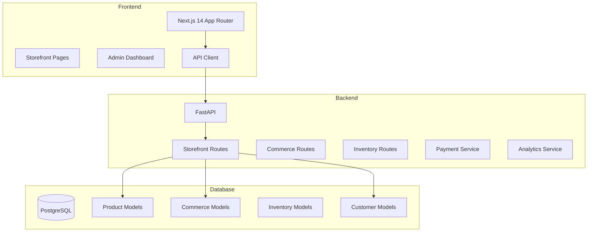

# MnD Business Suite - E-Commerce Storefront Implementation Plan

## Executive Summary

This document outlines the complete implementation plan for transforming the MnD Business Suite storefront into a fully-featured e-commerce system. The implementation is divided into 5 phases, each building upon the previous to deliver a production-ready online store.

**Current State:**
- Basic product listing with category filtering
- Cart and checkout endpoints exist
- Order creation and payment processing
- Product variants model exists
- Categories model exists

**Target State:**
- Full product catalog with categories, variants, and collections
- Real-time inventory management with stock tracking
- Persistent shopping cart with session management
- Complete checkout flow with multiple payment options
- Customer accounts with order history
- Discount codes and promotional pricing
- Shipping options configuration
- Comprehensive admin dashboard

---

## Architecture Overview



---

## Phase 1: Core Shopping Experience

### Objectives
Fix existing issues and ensure basic e-commerce flow works end-to-end.

### 1.1 Product Display Fix
**Backend:**
- [ ] Fix `get_product` endpoint to show all products (not just published)
- [ ] Add `is_published` filter to product detail endpoint
- [ ] Add stock quantity to product response

**Files:**
- `backend/app/api/v1/routes/storefront.py`

### 1.2 Inventory & Stock Visibility
**Backend:**
- [ ] Add `inventory_quantity` to product list response
- [ ] Add `is_in_stock` computed field
- [ ] Add `low_stock_threshold` to product model

**Database:**
- [ ] Add `inventory_quantity` field to Product model (or use from inventory)

**Frontend:**
- [ ] Display stock status on product cards
- [ ] Show "Out of Stock" badge when unavailable
- [ ] Disable "Add to Cart" for out-of-stock items

**Files:**
- `backend/app/models/inventory/product.py`
- `frontend/app/store/[org]/page.tsx`
- `frontend/components/store/ProductCard.tsx`

### 1.3 Cart Persistence
**Backend:**
- [ ] Add session-based cart retrieval
- [ ] Support guest cart with session ID
- [ ] Merge cart when guest logs in

**Frontend:**
- [ ] Persist cart ID in localStorage
- [ ] Auto-create cart on first visit
- [ ] Handle cart restoration on page load
- [ ] Add cart icon with item count in header

**Files:**
- `frontend/lib/store.ts`
- `frontend/components/layout/nav.ts`
- `backend/app/api/v1/routes/storefront.py`

### 1.4 Checkout Flow Completion
**Backend:**
- [ ] Add tax calculation endpoint
- [ ] Add shipping options endpoint
- [ ] Validate stock availability at checkout
- [ ] Order confirmation email trigger

**Frontend:**
- [ ] Multi-step checkout wizard
- [ ] Shipping address form with validation
- [ ] Order summary review step
- [ ] Success page with order details

**Files:**
- `frontend/app/store/[org]/checkout/page.tsx`
- `backend/app/api/v1/routes/storefront.py`

### 1.5 Order Processing
**Backend:**
- [ ] Auto-generate order number
- [ ] Create order items from cart
- [ ] Update inventory on order creation
- [ ] Handle order status transitions

**Files:**
- `backend/app/services/commerce/commerce_service.py`
- `backend/app/models/commerce/order.py`

---

## Phase 2: Enhanced Catalog

### Objectives
Build rich product catalog with variants, categories, and advanced search.

### 2.1 Category Management
**Backend:**
- [ ] CRUD endpoints for categories
- [ ] Category hierarchy support (parent/child)
- [ ] Category product count

**Frontend:**
- [ ] Category management page in admin
- [ ] Category sidebar on storefront
- [ ] Breadcrumb navigation

**Files:**
- `backend/app/api/v1/routes/inventory.py`
- `frontend/app/(app)/inventory/categories/page.tsx`

### 2.2 Product Variants
**Backend:**
- [ ] CRUD endpoints for variants
- [ ] Variant inventory management
- [ ] Variant pricing support

**Frontend:**
- [ ] Variant selector on product page
- [ ] Variant inventory display
- [ ] Add specific variant to cart

**Files:**
- `backend/app/models/inventory/product_variant.py`
- `backend/app/api/v1/routes/inventory.py`
- `frontend/app/store/[org]/product/[sku]/page.tsx`

### 2.3 Product Images & Media
**Backend:**
- [ ] Multiple images per product
- [ ] Image upload endpoint
- [ ] Image optimization metadata

**Database:**
- [ ] Create ProductImage model
- [ ] Link to Product model

**Frontend:**
- [ ] Image gallery on product page
- [ ] Thumbnail navigation
- [ ] Zoom on hover

### 2.4 Search & Filtering
**Backend:**
- [ ] Advanced search with filters
- [ ] Price range filtering
- [ ] Attribute filtering
- [ ] Sort options (price, name, newest)

**Frontend:**
- [ ] Search bar with autocomplete
- [ ] Filter sidebar
- [ ] Sort dropdown
- [ ] Active filters display

**Files:**
- `backend/app/api/v1/routes/storefront.py`
- `frontend/app/store/[org]/page.tsx`

### 2.5 Product Collections
**Backend:**
- [ ] Collection model
- [ ] Manual and automatic collections
- [ ] Collection API endpoints

**Frontend:**
- [ ] Collections page
- [ ] Featured products section

---

## Phase 3: Payments & Discounts

### Objectives
Implement comprehensive payment processing and promotional features.

### 3.1 Stripe Integration
**Backend:**
- [ ] Create Stripe payment intent
- [ ] Handle webhook for payment events
- [ ] Support multiple payment methods
- [ ] Refund processing

**Frontend:**
- [ ] Stripe Elements integration
- [ ] Card input component
- [ ] Payment processing UI
- [ ] Success/failure handling

**Files:**
- `backend/app/services/billing/stripe_service.py`
- `frontend/components/checkout/PaymentForm.tsx`

### 3.2 Discount Codes
**Database:**
- [ ] Create Promotion model
- [ ] Support percentage and fixed discounts
- [ ] Usage limits and expiration

**Backend:**
- [ ] Validate discount code endpoint
- [ ] Apply discount to order calculation
- [ ] Track usage count

**Frontend:**
- [ ] Discount code input on cart/checkout
- [ ] Validation feedback
- [ ] Show discount in order summary

### 3.3 Tax Calculation
**Backend:**
- [ ] Tax rate configuration per region
- [ ] Automatic tax calculation
- [ ] Tax summary in order

**Frontend:**
- [ ] Display tax breakdown
- [ ] Tax-inclusive pricing option

### 3.4 Shipping Options
**Database:**
- [ ] ShippingZone model
- [ ] ShippingRate model
- [ ] Free shipping thresholds

**Backend:**
- [ ] Calculate shipping by address
- [ ] Multiple shipping methods
- [ ] Estimated delivery dates

**Frontend:**
- [ ] Shipping method selection
- [ ] Delivery estimate display

---

## Phase 4: Customer Features

### Objectives
Enable customer accounts and order management.

### 4.1 Customer Registration
**Backend:**
- [ ] Customer signup endpoint
- [ ] Email verification
- [ ] Password reset flow

**Frontend:**
- [ ] Registration form
- [ ] Login form
- [ ] Password reset flow
- [ ] "Remember me" functionality

### 4.2 Customer Accounts
**Backend:**
- [ ] Customer profile endpoints
- [ ] Address book management
- [ ] Wishlist functionality

**Frontend:**
- [ ] My Account dashboard
- [ ] Profile editing
- [ ] Address management
- [ ] Wishlist page

### 4.3 Order History
**Backend:**
- [ ] List customer orders
- [ ] Order detail endpoint
- [ ] Order status tracking

**Frontend:**
- [ ] Order history page
- [ ] Order detail view
- [ ] Order tracking display
- [ ] Re-order functionality

### 4.4 Authentication Flow
**Backend:**
- [ ] JWT-based authentication
- [ ] Session management
- [ ] Guest checkout support

**Frontend:**
- [ ] Auth context provider
- [ ] Protected routes
- [ ] Login/register modals

---

## Phase 5: Admin Dashboard

### Objectives
Provide comprehensive management interface for store operators.

### 5.1 Orders Management
**Backend:**
- [ ] List all orders with filters
- [ ] Update order status
- [ ] Process refunds
- [ ] Print packing slips/invoices

**Frontend:**
- [ ] Orders list page
- [ ] Order detail view
- [ ] Status update actions
- [ ] Bulk operations

**Files:**
- `frontend/app/(app)/commerce/orders/page.tsx`

### 5.2 Products Management
**Backend:**
- [ ] Full CRUD for products
- [ ] Bulk import/export
- [ ] Inventory bulk update

**Frontend:**
- [ ] Products list with filters
- [ ] Product editor
- [ ] Variant editor
- [ ] Image manager

### 5.3 Customers Management
**Backend:**
- [ ] List customers
- [ ] Customer detail view
- [ ] Export customer data

**Frontend:**
- [ ] Customers list
- [ ] Customer detail with orders
- [ ] Add/Edit customer

### 5.4 Analytics Dashboard
**Backend:**
- [ ] Sales metrics
- [ ] Order analytics
- [ ] Top products
- [ ] Revenue reports

**Frontend:**
- [ ] Dashboard overview
- [ ] Charts and graphs
- [ ] Date range filters

---

## Database Schema Changes

### New Models

```python
# Promotion/Discount
class Promotion(TenantScopedBase):
    code: str
    discount_type: str  # percentage, fixed
    discount_value: float
    min_order_amount: float
    usage_limit: int
    usage_count: int
    starts_at: datetime
    expires_at: datetime

# Shipping
class ShippingZone(TenantScopedBase):
    name: str
    countries: list[str]
    regions: list[str]

class ShippingRate(TenantScopedBase):
    zone_id: str
    name: str
    price: float
    free_shipping_threshold: float
    estimated_days: int

# Customer Account (Storefront)
class StorefrontCustomer(TenantScopedBase):
    email: str
    password_hash: str
    first_name: str
    last_name: str
    phone: str
    is_verified: bool

class CustomerAddress(TenantScopedBase):
    customer_id: str
    name: str
    address_line1: str
    city: str
    state: str
    postal_code: str
    country: str
    is_default: bool
```

---

## API Endpoints Summary

### Storefront API
```
GET    /store/{org}/categories          # List categories
GET    /store/{org}/products              # List products (with filters)
GET    /store/{org}/products/{slug}       # Product detail
GET    /store/{org}/cart                  # Get cart
POST   /store/{org}/cart                  # Create cart
POST   /store/{org}/cart/items            # Add item
PUT    /store/{org}/cart/items/{id}       # Update item
DELETE /store/{org}/cart/items/{id}       # Remove item
POST   /store/{org}/checkout              # Process checkout
GET    /store/{org}/orders/{id}           # Get order
POST   /store/{org}/validate-promo        # Validate discount code
GET    /store/{org}/shipping-rates        # Get shipping options

# Customer
POST   /store/{org}/register              # Customer registration
POST   /store/{org}/login                 # Customer login
GET    /store/{org}/account               # Get account
PUT    /store/{org}/account               # Update account
GET    /store/{org}/orders                # List customer orders
```

### Admin API
```
# Products
GET/POST     /api/v1/inventory/products
GET/PUT/DEL  /api/v1/inventory/products/{id}
POST         /api/v1/inventory/products/{id}/variants

# Categories
GET/POST     /api/v1/inventory/categories
GET/PUT/DEL  /api/v1/inventory/categories/{id}

# Orders
GET          /api/v1/commerce/orders
GET/PUT      /api/v1/commerce/orders/{id}
POST         /api/v1/commerce/orders/{id}/refund

# Customers
GET          /api/v1/crm/customers
GET/PUT      /api/v1/crm/customers/{id}

# Promotions
GET/POST     /api/v1/commerce/promotions
GET/PUT/DEL  /api/v1/commerce/promotions/{id}

# Analytics
GET          /api/v1/analytics/overview
GET          /api/v1/analytics/sales
```

---

## Implementation Priority Matrix

| Feature | Complexity | Business Value | Priority |
|---------|-----------|---------------|----------|
| Product Display Fix | Low | High | P0 |
| Stock Visibility | Low | High | P0 |
| Cart Persistence | Medium | High | P0 |
| Checkout Completion | Medium | High | P0 |
| Stripe Integration | High | High | P1 |
| Category Management | Medium | Medium | P1 |
| Product Variants | Medium | Medium | P1 |
| Discount Codes | Medium | Medium | P2 |
| Customer Accounts | High | Medium | P2 |
| Search & Filtering | Medium | Medium | P2 |
| Admin Dashboard | High | High | P2 |
| Shipping Options | Medium | Medium | P3 |
| Tax Calculation | Medium | Medium | P3 |

---

## File Structure

```
backend/
├── app/
│   ├── api/v1/routes/
│   │   ├── storefront.py          # Storefront API
│   │   ├── commerce.py            # Commerce operations
│   │   └── inventory.py          # Inventory management
│   ├── models/
│   │   ├── commerce/
│   │   │   ├── cart.py
│   │   │   ├── order.py
│   │   │   └── promotion.py       # NEW
│   │   └── inventory/
│   │       ├── product.py
│   │       ├── category.py
│   │       └── shipping.py        # NEW
│   └── services/
│       ├── commerce/
│       │   ├── commerce_service.py
│       │   ├── payment_service.py
│       │   └── promotion_service.py  # NEW
│       └── billing/
│           └── stripe_service.py

frontend/
├── app/
│   ├── store/
│   │   └── [org]/
│   │       ├── page.tsx           # Product listing
│   │       ├── cart/
│   │       │   └── page.tsx       # Shopping cart
│   │       ├── checkout/
│   │       │   └── page.tsx       # Checkout flow
│   │       ├── product/
│   │       │   └── [sku]/
│   │       │       └── page.tsx   # Product detail
│   │       ├── categories/
│   │       │   └── page.tsx       # Category browsing
│   │       ├── search/
│   │       │   └── page.tsx       # Search results
│   │       └── account/
│   │           ├── page.tsx      # My account
│   │           └── orders/
│   │               └── page.tsx   # Order history
│   └── (app)/
│       └── commerce/
│           ├── orders/
│           │   └── page.tsx       # Admin orders
│           ├── products/
│           │   └── page.tsx       # Admin products
│           └── customers/
│               └── page.tsx       # Admin customers
├── components/
│   ├── store/
│   │   ├── ProductCard.tsx
│   │   ├── ProductGrid.tsx
│   │   ├── CategoryNav.tsx
│   │   ├── CartDrawer.tsx
│   │   └── SearchBar.tsx
│   ├── checkout/
│   │   ├── ShippingForm.tsx
│   │   ├── PaymentForm.tsx
│   │   └── OrderSummary.tsx
│   └── admin/
│       ├── OrderTable.tsx
│       ├── ProductForm.tsx
│       └── StatsCard.tsx
└── lib/
    ├── store.ts                    # Cart management
    ├── storefront.ts               # Storefront API client
    └── auth-store.ts               # Customer auth
```

---

## Acceptance Criteria

### Phase 1 (Core Shopping)
- [ ] Products display in storefront with stock status
- [ ] Cart persists across page refreshes
- [ ] Complete checkout flow creates order
- [ ] Order appears in database with correct totals

### Phase 2 (Enhanced Catalog)
- [ ] Categories display in navigation
- [ ] Products can be filtered by category
- [ ] Product variants selectable on detail page
- [ ] Search returns relevant results

### Phase 3 (Payments)
- [ ] Stripe payment form renders
- [ ] Successful payment creates paid order
- [ ] Discount codes reduce order total
- [ ] Shipping options calculate correctly

### Phase 4 (Customers)
- [ ] Customer can register and login
- [ ] Order history shows past purchases
- [ ] Guest checkout creates account option

### Phase 5 (Admin)
- [ ] Admin can view all orders
- [ ] Order status can be updated
- [ ] Products can be managed
- [ ] Dashboard shows sales metrics

---

## Timeline Estimate

| Phase | Features | Estimated Effort |
|-------|----------|------------------|
| Phase 1 | Core Shopping | 2-3 days |
| Phase 2 | Enhanced Catalog | 3-4 days |
| Phase 3 | Payments & Discounts | 3-4 days |
| Phase 4 | Customer Features | 3-4 days |
| Phase 5 | Admin Dashboard | 4-5 days |

**Total: 15-20 days**

---

*Document Version: 1.0*
*Created: 2026-04-01*
